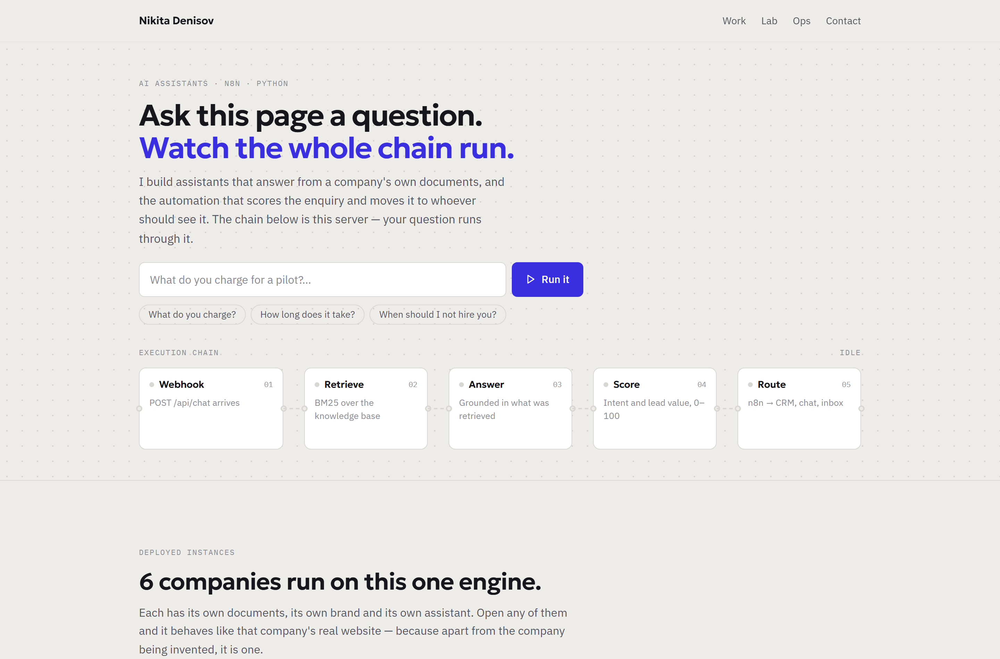
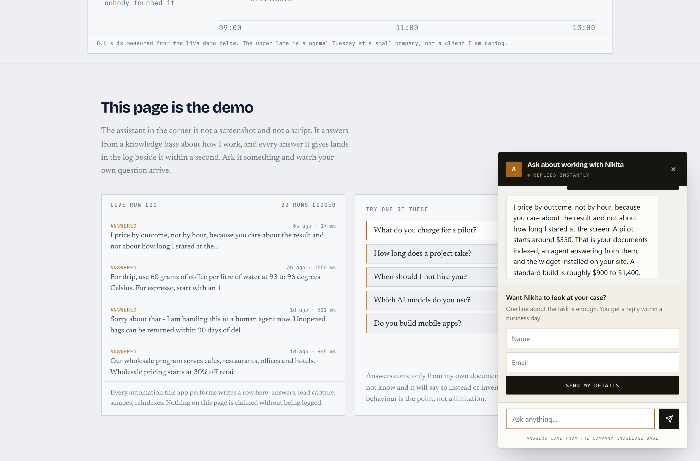
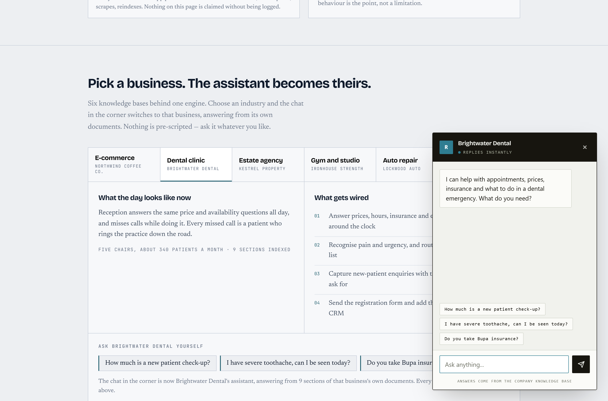
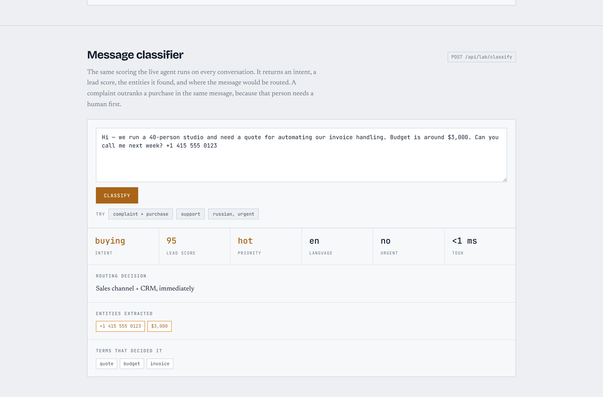
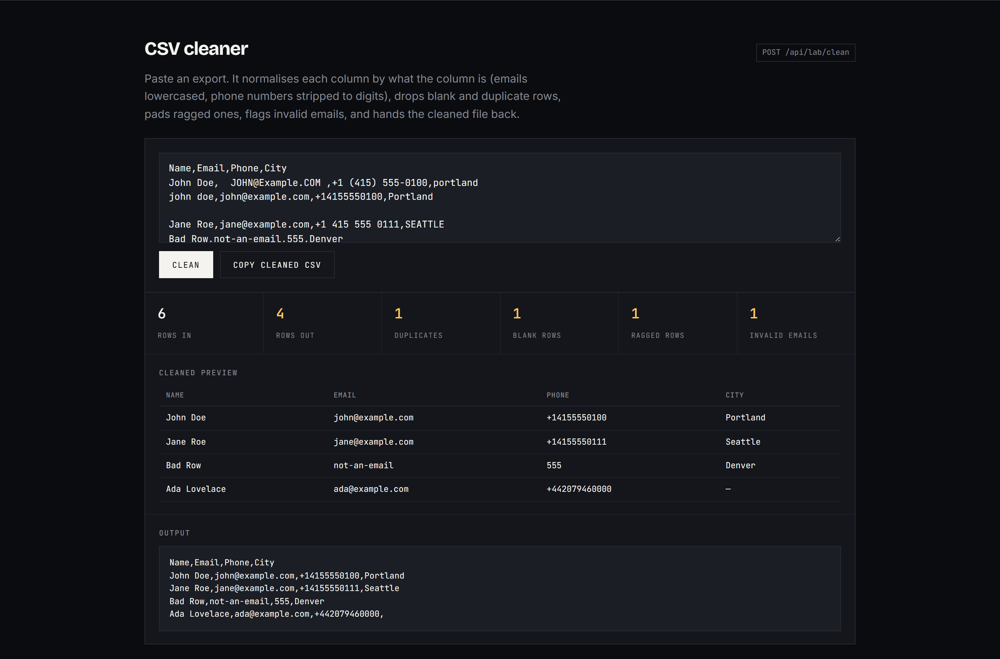
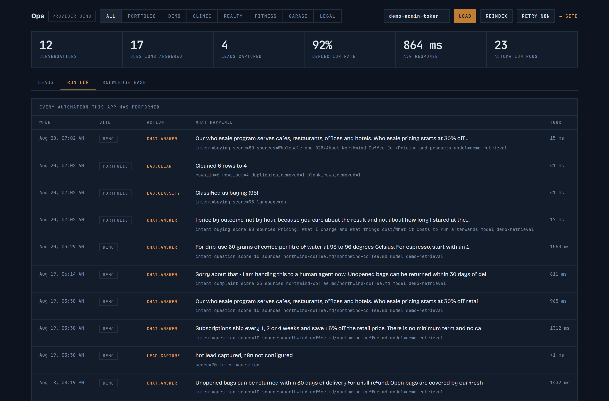
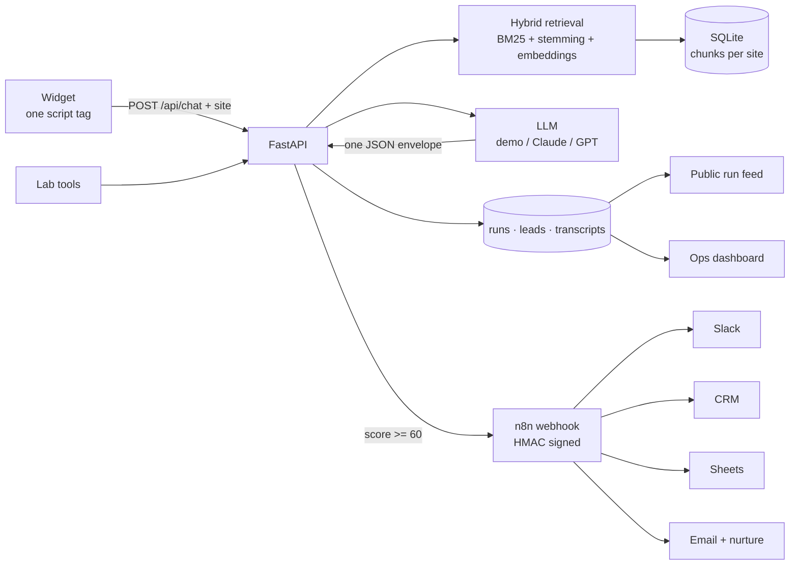

# AI Support & Lead Agent

**Live → <https://ai-support-agent-jett.onrender.com>**

One FastAPI service behind four surfaces. Not a landing page with screenshots of
software — the software, running, with the ledger open.

| | |
|---|---|
| [`/`](https://ai-support-agent-jett.onrender.com/) | Portfolio. Its assistant answers from a knowledge base about how I work, every answer lands in a live run log beside it, and an industry picker retargets the same widget at six different businesses. |
| [`/lab`](https://ai-support-agent-jett.onrender.com/lab) | Three tools you can run: a page scraper, a message classifier, a CSV cleaner. |
| [`/demo`](https://ai-support-agent-jett.onrender.com/demo) | The client-facing storefront the agent was built for. |
| [`/admin`](https://ai-support-agent-jett.onrender.com/admin) | Operations: leads, transcripts, run log and knowledge base across both sites. |

**Runs with zero API keys.** `demo` mode uses hybrid keyword retrieval and
templated answers, so the whole thing works — and costs nothing — before you add
a provider. Flip one environment variable to put Claude or GPT behind it.

```bash
git clone <this-repo> && cd ai-support-agent
./quickstart.sh --seed          # Windows: .\quickstart.ps1 -Seed
```

> Пошаговая инструкция на русском, с нуля: **[docs/SETUP-RU.md](docs/SETUP-RU.md)**



*The hero is the argument, not a claim: one enquiry drawn twice on a shared time
axis. Three hours and four handovers by hand; six tenths of a second and nobody
by the agent.*



*Ask the assistant something and your own question appears in the run log within
five seconds. Nothing on the page is claimed without being logged.*



*Six businesses, six knowledge bases, one engine. Pick an industry and the chat
in the corner becomes that company's assistant, answering from its own documents.
The picker is rendered from the server's site registry, so adding an industry is
a folder and a config entry — the page needs no edit.*

|  |  |
|---|---|
|  |  |
| The lab: intent, lead score, extracted entities and a routing decision | The lab: dedupe, normalise per column, flag invalid emails, return the file |



*Every automation the app performs writes a row: answers, lead capture, scrapes,
reindexes. The public feed and this log read the same table.*

Screenshots are generated, not cropped — `python -m scripts.screenshots` drives
the real app in a real browser and rewrites `docs/screenshots/`.

---

## The problem this solves

A small business answers the same forty questions every day. A human handles all
of them, and the one message that was actually worth money sits in the same
inbox as the rest.

| | Before | After |
|---|---|---|
| Repetitive questions | answered by a human, hours later | answered instantly from the company's own documents |
| Commercial enquiries | buried in the queue | scored, flagged hot, pushed to Slack and CRM in seconds |
| Out-of-scope questions | invented answers or silence | explicit hand-off, contact captured |
| Visibility | none | deflection rate, lead volume, transcripts, run log |

---

## How it works



Every LLM call returns the same envelope, which is what makes routing possible:

```json
{ "answer": "…", "intent": "buying", "lead_score": 85,
  "handoff": false, "ask_for_contact": true }
```

### Sites

One engine, seven knowledge bases. A site is a folder under `knowledge/` plus an
entry in `config.SITES`. Chunks, conversations, leads and runs all carry a
`site`, so adding a client is a folder and a dict — not a second deployment.

| Site | Business | Sections |
|---|---|---|
| `portfolio` | how I work: scope, pricing, what I turn down | 9 |
| `demo` | Northwind Coffee Co., specialty roaster | 9 |
| `clinic` | Brightwater Dental, five chairs | 9 |
| `realty` | Kestrel Property, estate agency | 8 |
| `fitness` | Ironhouse Strength, 480 members | 9 |
| `garage` | Lockwood Auto, MOT centre | 9 |
| `legal` | Marsden Law, six solicitors | 9 |

Entries marked `vertical` also render the industry picker on the front page,
including each one's pipeline and sample questions. The smoke test asserts that
every question the page advertises actually returns an answer — an advertised
question that produces "I do not know" is worse than not offering it.

The six businesses are invented. Their documents are written the way a real
FAQ is, and the pipelines describe what would get wired, but there are no
percentages anywhere: I have not measured these companies, and an invented
saving would undermine everything else on the page.

---

## Setup

### Demo mode, no keys

```bash
./quickstart.sh --seed
```

`--seed` writes three days of sample traffic, including its run log, so the
dashboard is not empty. Skip it for a clean start.

### Real LLM

```ini
LLM_PROVIDER=anthropic
ANTHROPIC_API_KEY=sk-ant-...
OPENAI_API_KEY=sk-...        # optional, enables embeddings
```

Or point `LLM_PROVIDER=openai` at anything OpenAI-compatible — OpenRouter,
DeepSeek, a local Ollama — via `OPENAI_BASE_URL`, then `python -m scripts.ingest`.

### n8n hand-off

```bash
docker compose up --build      # agent on :8000, n8n on :5678
```

Import `n8n/lead-routing.json`, set credentials, activate. Payloads are
HMAC-SHA256 signed in `X-Signature` and verified by the first Code node.

No Docker? `python -m scripts.fake_n8n` is a signature-verifying webhook sink
that prints each lead, so the outbound half can be demonstrated in one terminal.

Leads are written to SQLite **before** the webhook fires, so none is lost to an
outage. The dashboard shows three states — `sent`, `n8n off` (no webhook
configured, a setup choice rather than a fault) and `failed` — and **Retry n8n**
replays every undelivered one with its transcript.

### Deploying

`render.yaml` is a Render blueprint — **New → Blueprint**, pick the repo, enter
an `ADMIN_TOKEN`. The Dockerfile reads `$PORT`, so Railway, Fly and Cloud Run
work the same way. `SEED_ON_START=true` fills an empty database on free tiers
that have no persistent disk.

---

## API

| Method | Path | Auth | Purpose |
|---|---|---|---|
| `POST` | `/api/chat` | public | Message + site → answer, intent, score |
| `POST` | `/api/lead` | public | Inline contact form |
| `GET` | `/api/runs` | public | The activity ledger the front page reads |
| `POST` | `/api/lab/scrape` | public | Fetch a page, return its structure |
| `POST` | `/api/lab/classify` | public | Intent, score, entities, routing |
| `POST` | `/api/lab/clean` | public | Normalise and deduplicate a CSV |
| `GET` | `/api/health` | public | Provider, sites, index sizes |
| `GET` | `/api/metrics` | admin | Totals, per-site breakdown, run counts |
| `GET` | `/api/leads` | admin | Leads with delivery status |
| `GET` | `/api/knowledge` | admin | Every indexed section |
| `GET` | `/api/conversations/{id}` | admin | Full transcript |
| `POST` | `/api/reindex` | admin | Re-read the knowledge folder |
| `POST` | `/api/leads/retry` | admin | Replay undelivered leads |

Admin routes take `X-Admin-Token`. Public routes are rate limited (20/min;
8/min for the lab, since fetching a remote page costs more). Docs at `/docs`.

---

## Layout

```
app/
  main.py       routes, rate limiting, admin auth, four pages
  rag.py        chunking, stemming, hybrid BM25/vector retrieval per site
  llm.py        demo | Anthropic | OpenAI-compatible, one envelope
  lab.py        scraper (SSRF-guarded), classifier, CSV cleaner
  leads.py      contact extraction, HMAC signing, n8n delivery + replay
  db.py         SQLite schema, migrations, run log
  config.py     env-driven settings and the site registry
web/            portfolio · lab · storefront · ops · embeddable widget
knowledge/      portfolio/ and demo/ — one folder per site
n8n/            importable lead-routing workflow
scripts/        ingest · seed_demo · smoke_test · fake_n8n · screenshots
```

## Verifying it works

```bash
python -m scripts.smoke_test
```

68 checks, no server and no API keys: all seven knowledge bases, retrieval
quality, tenant isolation by provenance, every question the industry picker
advertises, chat and scoring, lead capture, the run log, all three lab tools,
SSRF refusal on four hostile URLs, admin auth and every page. The one live-network check skips rather than fails
when offline.

---

## Decisions worth explaining

**SQLite, not a vector database.** An SMB knowledge base is a few hundred
sections. Pinecone would add a service to operate and a bill to pay for latency
nobody notices. Swapping it out touches one function, `rag.search()`.

**Hybrid retrieval with a stemmer.** Pure embeddings blur exact tokens — order
numbers, SKUs, "net 30". BM25 catches those. And without stemming, "how much
does it cost" misses a section headed "running costs", which is the single most
common question a prospect asks.

**A coordination factor on BM25.** Plain BM25 ranked a storage tip above the
shipping policy for "how long does shipping take", because it rewards a rare
term in a short document. Scaling by the share of query terms a chunk covers
fixed it.

**The scraper resolves the host before fetching.** An endpoint that takes a URL
from the internet and fetches it from inside your server is an SSRF hole unless
private, loopback, link-local and reserved ranges are refused first.

**A complaint outranks a purchase.** "My order arrived broken and I want to
reorder" is a person who needs a human, not a sales pitch. The classifier scores
it as a complaint even though the buying signal is worth more.

**The bot fails toward a human.** No context, an API error, an angry customer —
all three produce a hand-off and a contact capture, never an invented policy.

## What I would add for a production deployment

- Postgres + pgvector past roughly 5k sections
- Streamed responses for perceived latency
- A weekly digest of unanswered questions — the highest-value input for
  improving a knowledge base
- Answer-quality evals on a fixed question set before every knowledge update

---

Built by **Nikita Denisov** — n8n, Python and AI automation for small
businesses. See [docs/UPWORK.md](docs/UPWORK.md) for the portfolio write-up.

MIT licensed. Northwind Coffee Co. is fictional; any resemblance to a real
roaster is a coincidence and a compliment.
