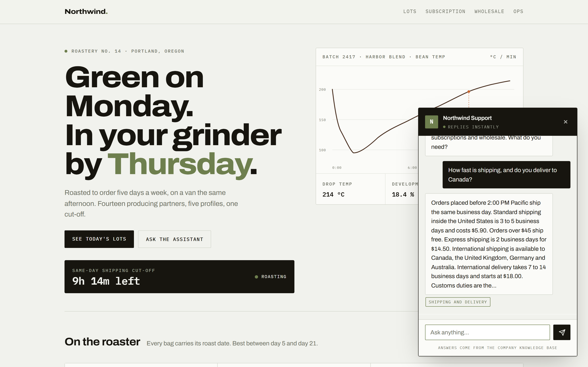
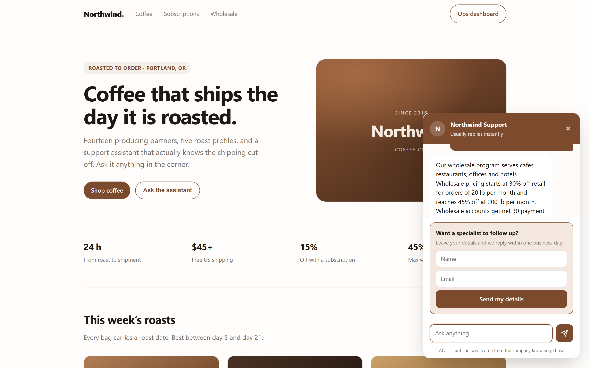
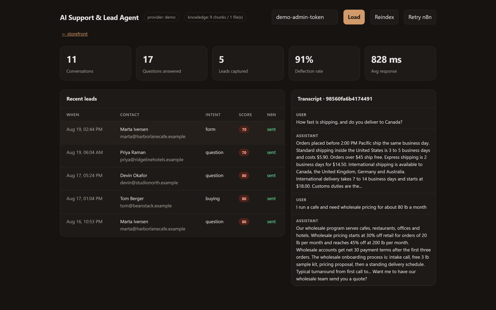
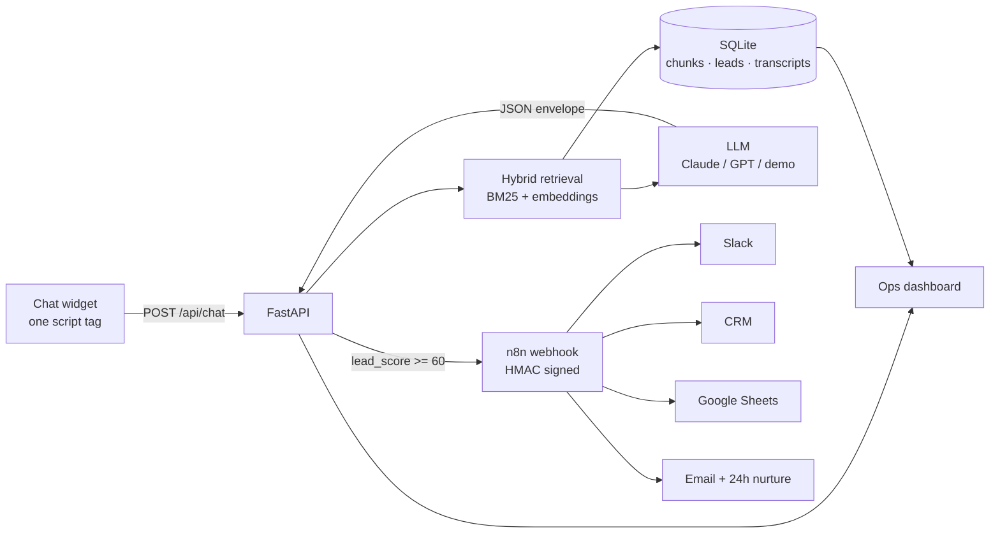

# AI Support & Lead Agent

**Live demo → <https://ai-support-agent-jett.onrender.com>**
Open the chat, ask *"how fast is shipping?"*, then ask *"what's your wholesale
price for 80 lb a month?"* and watch it switch from answering to selling.

A website chat agent that answers customer questions from the company's own
documents, scores every conversation for buying intent, and pushes hot leads
into the client's CRM through n8n — while the cold ones quietly get logged.

**Runs with zero API keys.** `demo` mode uses keyword retrieval and templated
answers, so anyone can clone the repo and see the whole pipeline working in
about 60 seconds. Flip one environment variable to run it on Claude or GPT.

```bash
git clone <this-repo> && cd ai-support-agent
./quickstart.sh --seed          # Windows: .\quickstart.ps1 -Seed
```

Then open <http://127.0.0.1:8000> — ask about shipping, then ask about wholesale
pricing, and watch the lead form appear. Results land in the
[ops dashboard](http://127.0.0.1:8000/admin) (token: `demo-admin-token`).

> Пошаговая инструкция на русском, с нуля: **[docs/SETUP-RU.md](docs/SETUP-RU.md)**

|  |  |
|---|---|
|  |  |
| Answers come from the company's own documents, with the source section shown under each reply | The moment intent turns commercial, the bot stops answering and starts qualifying |



*Deflection rate, captured leads with their intent score, n8n delivery status,
and the full transcript behind every lead.*

Screenshots are generated, not cropped by hand — `python -m scripts.screenshots`
drives the real app in a real browser and rewrites `docs/screenshots/`.

---

## The problem this solves

A small e-commerce brand gets the same forty questions every day — shipping
times, return policy, subscription changes. A human answers all of them, and the
one message that was actually worth money ("we're a cafe, what's your wholesale
price for 80 lb a month?") sits in the same inbox as the rest.

This agent splits the two apart:

| | Before | After |
|---|---|---|
| Repetitive questions | answered by a human, 4h response | answered instantly from the knowledge base |
| Commercial enquiries | buried in the queue | scored, flagged hot, pushed to Slack + CRM in seconds |
| Out-of-scope questions | invented answers or silence | explicit hand-off, contact captured |
| Visibility | none | deflection rate, lead volume, full transcripts |

The demo brand — Northwind Coffee Co. — is fictional, but the knowledge base,
the intents and the routing rules are the shape of a real client build.

---

## How it works



Every LLM call returns the same JSON envelope, which is what makes the routing
possible:

```json
{
  "answer": "Wholesale pricing starts at 30% off retail for 20 lb per month...",
  "intent": "buying",
  "lead_score": 85,
  "handoff": false,
  "ask_for_contact": true
}
```

`lead_score` drives everything downstream: whether the widget shows the contact
form, whether n8n pages the sales channel, and whether the lead enters the
nurture sequence instead.

---

## Setup

### 1. Demo mode (no keys, 60 seconds)

```bash
./quickstart.sh --seed
```

`--seed` fabricates three days of realistic traffic so the dashboard has
something to show. Skip it for a clean start.

Manual equivalent:

```bash
python -m venv .venv && .venv/bin/pip install -r requirements.txt
cp .env.example .env
.venv/bin/python -m scripts.ingest --no-embed
.venv/bin/python -m uvicorn app.main:app --port 8000
```

### 2. Real LLM

Edit `.env`:

```ini
LLM_PROVIDER=anthropic
ANTHROPIC_API_KEY=sk-ant-...
ANTHROPIC_MODEL=claude-sonnet-4-5

# Embeddings always go through an OpenAI-compatible endpoint.
# Leave the key blank to stay on keyword-only retrieval.
OPENAI_API_KEY=sk-...
```

Or point `LLM_PROVIDER=openai` at anything OpenAI-compatible — OpenRouter,
DeepSeek, a local Ollama — by changing `OPENAI_BASE_URL`. Then re-index so the
chunks get vectors:

```bash
python -m scripts.ingest
```

### 3. n8n hand-off

```bash
docker compose up --build      # agent on :8000, n8n on :5678
```

In n8n: **Import from file** → `n8n/lead-routing.json` → set credentials for the
nodes you want → activate. The compose file already points the agent at
`http://n8n:5678/webhook/lead-intake`.

Running n8n elsewhere? Put its production webhook URL in `.env`:

```ini
N8N_WEBHOOK_URL=https://your-n8n.app/webhook/lead-intake
N8N_WEBHOOK_SECRET=a-long-random-string
```

The payload is HMAC-SHA256 signed in the `X-Signature` header and verified by
the first Code node, so a leaked webhook URL is not enough to inject fake leads.

Leads are written to SQLite **before** the webhook fires, so a lead is never
lost to a webhook outage. The dashboard reports three distinct states — `sent`,
`n8n off` (no webhook configured, which is a setup choice rather than a fault),
and `failed` — and **Retry n8n** replays every undelivered lead with its full
transcript attached.

### 4. Deploying

`render.yaml` is a Render blueprint — **New → Blueprint**, pick the repo, enter
an `ADMIN_TOKEN`, done. The Dockerfile reads `$PORT`, so Railway, Fly and Cloud
Run work the same way.

Free tiers give you no persistent disk, which would leave a prospective client
looking at an empty dashboard after every restart. `SEED_ON_START=true` fills an
empty database with sample traffic at boot, so the demo is never blank.

---

## Making it a client's bot

Three steps, no code:

1. **Knowledge** — drop the client's FAQ, policies and product docs into
   `knowledge/` as `.md` or `.txt`. Markdown headings become retrieval sections,
   so keep one topic per heading. Hit **Reindex** in the dashboard.
2. **Brand** — set `COMPANY_NAME` and `AGENT_NAME` in `.env`, and pass
   `data-accent` on the script tag.
3. **Install** — one line in the client's theme:

```html
<script src="https://your-host/static/widget.js"
        data-api="https://your-host"
        data-title="Acme Support"
        data-agent="Ada"
        data-accent="#2563eb"
        data-quick="Where is my order?|Do you ship to the EU?|I need a bulk quote"
        defer></script>
```

The widget is vanilla JS with no dependencies and no build step. It works on
Shopify, WooCommerce, Webflow, WordPress or a plain HTML page.

---

## API

| Method | Path | Auth | Purpose |
|---|---|---|---|
| `POST` | `/api/chat` | public | Send a message, get answer + intent + score |
| `POST` | `/api/lead` | public | Submit the inline contact form |
| `GET` | `/api/health` | public | Provider, index size, n8n status |
| `GET` | `/api/metrics` | admin | KPIs for the dashboard |
| `GET` | `/api/leads` | admin | Recent leads with delivery status |
| `GET` | `/api/conversations/{id}` | admin | Full transcript |
| `POST` | `/api/reindex` | admin | Re-read the knowledge folder |
| `POST` | `/api/leads/retry` | admin | Replay leads n8n never received |

Admin routes take an `X-Admin-Token` header. Public routes are rate limited to
20 requests per minute per IP. Interactive docs at `/docs`.

```bash
curl -X POST localhost:8000/api/chat \
  -H 'Content-Type: application/json' \
  -d '{"message":"Do you ship to Canada?"}'
```

---

## Layout

```
app/
  main.py       FastAPI routes, rate limiting, admin auth
  rag.py        chunking + hybrid BM25/vector retrieval
  llm.py        demo | Anthropic | OpenAI-compatible, one envelope
  leads.py      contact extraction, HMAC signing, n8n delivery + replay
  db.py         SQLite schema and queries
  config.py     env-driven settings
web/
  index.html    demo storefront (fictional brand)
  admin.html    ops dashboard
  widget.js     embeddable widget, no dependencies
  widget.css    themeable via CSS variables
knowledge/      the bot's source of truth (.md / .txt)
n8n/            importable lead-routing workflow
scripts/        ingest · seed_demo · smoke_test · fake_n8n · screenshots
```

## Verifying it works

```bash
python -m scripts.smoke_test
```

No n8n handy? `python -m scripts.fake_n8n` is a signature-verifying
webhook sink, so the outbound half of the integration can be demonstrated
in one terminal window instead of a Docker stack.

Twenty checks with no server and no API keys: indexing, retrieval quality on six
real questions, chat, intent scoring, both lead-capture paths, admin auth, and
static assets. Exit code 0 means the pipeline is healthy on this machine.

---

## Decisions worth explaining

**SQLite, not a vector database.** An SMB knowledge base is a few hundred
chunks. Pinecone or Qdrant would add a service to operate, a bill, and a network
hop, in exchange for latency nobody would notice. Swapping it out later touches
one function, `rag.search()`.

**Hybrid retrieval, keyword always on.** Pure embeddings blur exact tokens —
order numbers, SKUs, "net 30". BM25 catches those. It also means the system
degrades to something useful rather than nothing when the embeddings API fails,
and it is what lets demo mode exist at all.

**A coordination factor on BM25.** Plain BM25 ranked a storage tip above the
shipping policy for "how long does shipping take", because it rewards a rare
term in a short document. Scaling each score by the share of query terms a chunk
actually covers fixed it — see the test in `scripts/smoke_test.py`.

**One JSON envelope from every provider.** Answer, intent, score and hand-off
come back in a single call. Two calls would double latency and cost for a
classification the model has already effectively made.

**No LLM SDKs.** Raw HTTP through `httpx` keeps the dependency list at four
packages and makes any OpenAI-compatible endpoint work by editing one env var.

**The bot fails toward a human.** No context, an API error, an angry customer —
all three produce a hand-off and a contact capture, never an invented policy.
A wrong answer about a refund costs more than an unanswered question.

## What I would add for a production deployment

- Postgres + pgvector once the knowledge base passes ~5k chunks
- Per-tenant isolation if it serves more than one client from one instance
- Streamed responses for perceived latency
- A weekly digest of unanswered questions — the highest-value input for
  improving the knowledge base
- Answer-quality evals on a fixed question set before every knowledge update

---

Built by **[your name]** — n8n, Python, and AI automation for small businesses.
See [docs/UPWORK.md](docs/UPWORK.md) for the portfolio write-up and the copy to
paste into an Upwork portfolio item.

MIT licensed. Northwind Coffee Co. is fictional; any resemblance to a real
roaster is a coincidence and a compliment.
